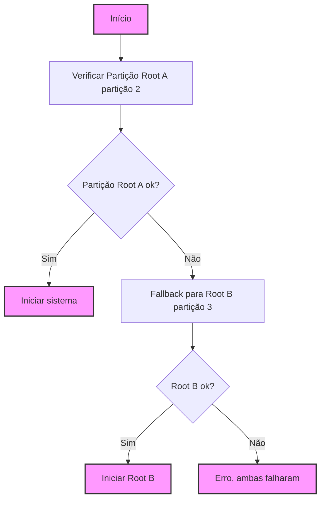

# Tutorial: Configuração de Dual Boot com Fallback Automático no Raspberry Pi

Este tutorial descreve como configurar um sistema de **dual boot** no Raspberry Pi com uma funcionalidade de **fallback automático**. Caso a partição principal falhe, o sistema tentará inicializar a partir de uma partição secundária.

## Etapas para Configuração

### 1. Preparação do Cartão SD

1. **Conecte o Cartão SD** ao Raspberry Pi ou ao seu computador.
2. **Formatação do Cartão SD**:
   - Crie três partições no cartão SD:
     - **Partição 1**: `/boot` (FAT32, 256MB)
     - **Partição 2**: `Root A` (ext4, 3GB)
     - **Partição 3**: `Root B` (ext4, restante do espaço).
3. **Clonagem da imagem rootfs.img** para as partições `Root A` e `Root B` usando ferramentas como `dd` ou `Etcher`.

---

### 2. Instalação de Scripts e Serviço Systemd

1. **Baixar os scripts necessários**:
   - Baixe o script de validação (`validate-boot.sh`) e o arquivo de serviço (`validate-boot.service`).
   
2. **Configurar o arquivo de serviço systemd**:
   - Copie o arquivo `validate-boot.service` para `/etc/systemd/system/`.
   
3. **Configurar o script de validação**:
   - Copie o script `validate-boot.sh` para `/usr/local/bin/`.
   
4. **Tornar o script executável**:
   ```bash
   sudo chmod +x /usr/local/bin/validate-boot.sh

5. **Habilitar o serviço systemd**:
   ```bash
   sudo systemctl enable validate-boot.service

6. **Iniciar o serviço**:
   ```bash
   sudo systemctl start validate-boot.service

### 3. Verificação do Sistema de Partições

Na inicialização, o serviço systemd verifica a partição Root A (p2) montando-a em /mnt.

Se a partição Root A estiver corrompida ou inacessível, o sistema tentará montar a partição Root B (p3).

Caso ambas as partições falhem, o sistema exibirá um erro e não fará o boot.

### 4. Execução do Sistema

Quando o Raspberry Pi for reiniciado, o validate-boot.service será executado para verificar as partições e garantir que o sistema inicie corretamente a partir da partição válida.



### Resolução de Problemas

Partição Root A não funcionando:
Caso o Raspberry Pi não inicie da partição Root A, o serviço validate-boot.service tentará a partição Root B.

Ambas as partições falharem:
Se as duas partições falharem, uma mensagem de erro será exibida, indicando que não foi possível inicializar o sistema.

